# Github API Mocking and Github Actions Testing System (GAMGATS) 

## High level architecture

```mermaid
---
title: GitHub API Mock System - Architecture Overview
---
graph TB
    subgraph DOCKER["🐳 Docker Network"]
        subgraph RUNNER["🏃 act-runner Container"]
            AR[GitHub Actions Runner<br/>🔧 act tool]
            AR -->|HTTPS requests| GH_ALIAS[github.com alias<br/>→ nginx container]
            AR -->|HTTPS requests| API_ALIAS[api.github.com alias<br/>→ nginx container]
        end
        
        subgraph PROXY["🔀 github-proxy Container (Nginx)"]
            NGINX[Nginx Reverse Proxy<br/>🔒 Port 443/80]
            
            subgraph GH_BLOCK["🌐 Server Block: github.com"]
                GH_SERVER[server github.com:443]
                GH_ACTIONS["🚀 /actions/* → Real GitHub<br/>(passthrough)"]
                GH_PULLS["📋 /repos/.../pulls/.../files<br/>→ Mock API"]
                GH_ISSUES["💬 /repos/.../issues/.../comments<br/>→ Mock API"]
                GH_GIT["📦 /info/refs, /git-*<br/>→ Real GitHub"]
                GH_DEFAULT["🌍 /* → Real GitHub<br/>(default)"]
            end
            
            subgraph API_BLOCK["🔌 Server Block: api.github.com"]
                API_SERVER[server api.github.com:443]
                API_PULLS["📋 /repos/.../pulls/.../files<br/>→ Mock API"]
                API_ISSUES_COMMENTS["💬 /repos/.../issues/.../comments<br/>→ Mock API"]
                API_ISSUES["📝 /repos/.../issues<br/>→ Mock API (GET/POST)"]
                API_STATUS["✅ /repos/.../statuses/*<br/>→ Mock API"]
                API_PULL_DETAILS["🔍 /repos/.../pulls/123<br/>→ Mock API"]
                API_DEFAULT["🌍 /* → Real GitHub API<br/>(default)"]
            end
        end
        
        subgraph MOCK_SERVICE["🎭 mock-github-api Container"]
            MOCK[Express.js Server<br/>🔒 Port 443 ]
            
            subgraph ENDPOINTS["📡 Mock Endpoints"]
                MOCK_PULLS["📋 Pull Files Endpoint<br/>Returns scenario-based data"]
                MOCK_ISSUES_LIST["📄 List Issues<br/>GET with label filtering"]
                MOCK_ISSUES_CREATE["➕ Create Issue<br/>POST with storage"]
                MOCK_COMMENTS["💬 Create Comment<br/>POST responses"]
                MOCK_STATUS["✅ Commit Status<br/>POST responses"]
                MOCK_PULL_DETAILS["🔍 Pull Details<br/>GET single PR info"]
            end
            
            MEMORY[("💾 In-Memory Storage<br/>Issues & Counter<br/>Persistent during session")]
        end
        
        subgraph EXTERNAL["🌐 External Services"]
            REAL_GITHUB["🐙 github.com<br/>Real GitHub"]
            REAL_API["🔌 api.github.com<br/>Real GitHub API"]
        end
    end
    
    subgraph SSL["🔐 SSL Infrastructure"]
        CERTS["📜 Self-signed Certificates<br/>• github.com<br/>• api.github.com<br/>• *.github.com<br/>Auto-generated via OpenSSL"]
    end
    
    %% Request routing
    GH_ALIAS --> NGINX
    API_ALIAS --> NGINX
    
    NGINX --> GH_SERVER
    NGINX --> API_SERVER
    
    %% GitHub.com routing
    GH_ACTIONS --> REAL_GITHUB
    GH_PULLS --> MOCK
    GH_ISSUES --> MOCK
    GH_GIT --> REAL_GITHUB
    GH_DEFAULT --> REAL_GITHUB
    
    %% API.github.com routing
    API_PULLS --> MOCK
    API_ISSUES_COMMENTS --> MOCK
    API_ISSUES --> MOCK
    API_STATUS --> MOCK
    API_PULL_DETAILS --> MOCK
    API_DEFAULT --> REAL_API
    
    %% Mock service internals
    MOCK --> MOCK_PULLS
    MOCK --> MOCK_ISSUES_LIST
    MOCK --> MOCK_ISSUES_CREATE
    MOCK --> MOCK_COMMENTS
    MOCK --> MOCK_STATUS
    MOCK --> MOCK_PULL_DETAILS
    
    MOCK_ISSUES_CREATE -.->|stores| MEMORY
    MOCK_ISSUES_LIST -.->|reads| MEMORY
    
    %% SSL usage
    NGINX -.->|uses| CERTS
    MOCK -.->|uses| CERTS
    
    classDef container fill:#e1f5fe,stroke:#01579b,stroke-width:2px,color:#000
    classDef nginx fill:#fff3e0,stroke:#e65100,stroke-width:2px,color:#000
    classDef mock fill:#e8f5e8,stroke:#2e7d32,stroke-width:2px,color:#000
    classDef real fill:#fce4ec,stroke:#c2185b,stroke-width:2px,color:#000
    classDef storage fill:#f3e5f5,stroke:#7b1fa2,stroke-width:2px,color:#000
    classDef ssl fill:#e3f2fd,stroke:#1976d2,stroke-width:2px,color:#000
    
    class AR,NGINX,MOCK container
    class GH_SERVER,API_SERVER,GH_ACTIONS,GH_PULLS,GH_ISSUES,GH_GIT,GH_DEFAULT,API_PULLS,API_ISSUES_COMMENTS,API_ISSUES,API_STATUS,API_PULL_DETAILS,API_DEFAULT nginx
    class MOCK_PULLS,MOCK_ISSUES_LIST,MOCK_ISSUES_CREATE,MOCK_COMMENTS,MOCK_STATUS,MOCK_PULL_DETAILS mock
    class REAL_GITHUB,REAL_API real
    class MEMORY storage
    class CERTS ssl
```

## Request Flow Sequence Diagram

## Nginx Routing Diagram

## Test Scenarios and Mock Data Structures

## Docker Deployment and Network Architecture

